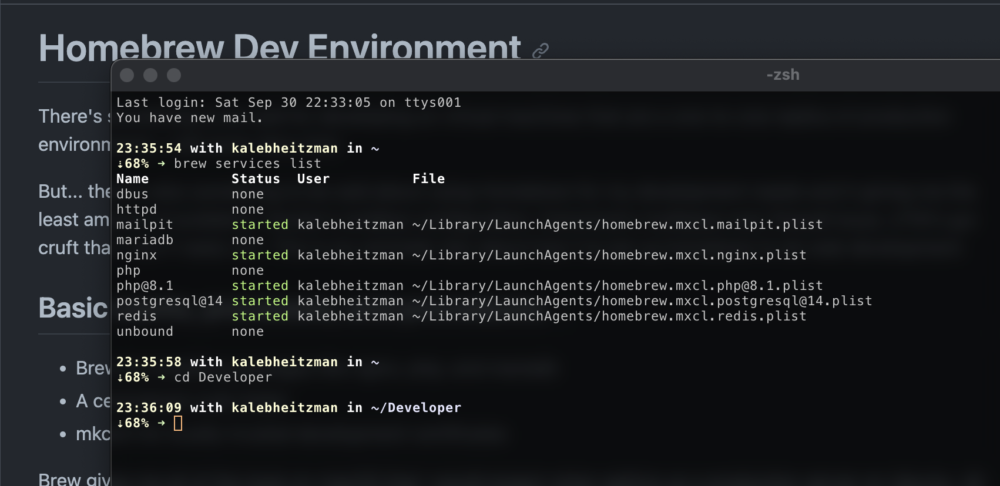

# Homebrew Dev Environment

There's something to be said for developing on virtual machines that are a one-to-one replica of production environments. I will never deny that.

But... there's also something to be said about using Homebrew for my development needs and it giving me the least amount of problems. Docker's endless configuration, Canonical's multipass mac firewall issue, UTM's gui cruft that I don't need, etc. This is my reminder doc about how I've set up homebrew to do web development.

## Basic wants, processes, and procedures

- Brew for installing packages like nginx, php, and mariadb
- A centralized code folder
- mkcert for locally-trusted development certificates
- Easy to start and stop daemonized services

Brew gives me all of the tools on macOS that I would expect when setting up a production server on Ubuntu. All code goes into `~/Developer` so I can easily get to everything in one spot. AND... I use `mkcert` to generate certificates that I can use locally by wiring them up in nginx. Being able to test https locally is essential.

Dead simple daemon control comes with `brew services` so I can launch web services and shut them down at will.



## Installing Brew and some basic development tools

Homebrew, the missing [package manager](https://brew.sh/) for macOS (or linux).

```zsh
/bin/bash -c "$(curl -fsSL https://raw.githubusercontent.com/Homebrew/install/HEAD/install.sh)"
```

This will install everything to the prefix `/opt/homebrew` including things like nginx/postgres configuration. On a typical Ubuntu sytem, you'll find nginx configuration at `/etc/nginx`. That same path becomes `/opt/homebrew/etc/nginx` on macOS.

**Brew basics**

```zsh
brew doctor
brew outdated
brew update
brew upgrade
```
