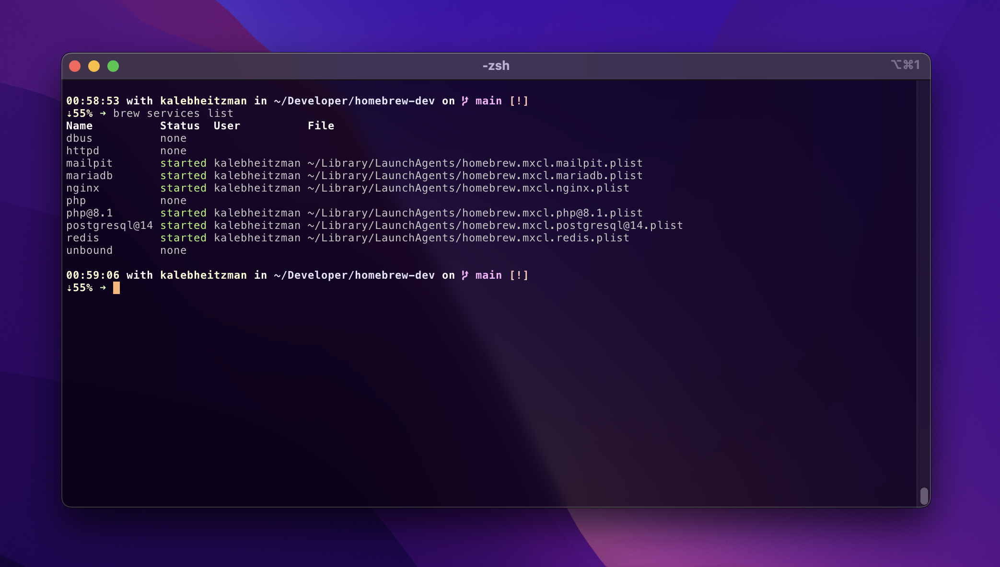

# Homebrew Dev Environment

There's something to be said for developing on virtual machines that are a one-to-one replica of production environments. I will never deny that.

But... there's also something to be said about using Homebrew for my development needs and it giving me the least amount of problems. Docker's endless configuration, Canonical's multipass mac firewall issue, UTM's gui cruft that I don't need, etc. This is my reminder doc about how I've set up homebrew to do web development.

## Basic wants, processes, and procedures

- Brew for installing packages like nginx, php, and mariadb
- A centralized code folder
- mkcert for locally-trusted development certificates
- Easy to start and stop daemonized services

Brew gives me all of the tools on macOS that I would expect when setting up a production server on Ubuntu. All code goes into `~/Developer` so I can easily get to everything in one spot. AND... I use `mkcert` to generate certificates that I can use locally by wiring them up in nginx. Being able to test https locally is essential.

Dead simple daemon control comes with `brew services` so I can launch web services and shut them down at will.



## Installing Brew and some basic development tools

Homebrew, the missing [package manager](https://brew.sh/) for macOS (or linux).

```zsh
/bin/bash -c "$(curl -fsSL https://raw.githubusercontent.com/Homebrew/install/HEAD/install.sh)"
```

This will install everything to the prefix `/opt/homebrew` including things like nginx/postgres configuration. On a typical Ubuntu sytem, you'll find nginx configuration at `/etc/nginx`. This path becomes `/opt/homebrew/etc/nginx` on macOS.

## Using mkcert to generate local development certificates

I use `mkcert` to generate local development certicates and add entries to `/etc/hosts` to map domains to nginx. You can setup `dnsmasq` to resolve a domain suffix of your choice but I have avoided this because there have been issues with people masking entire TLDs like `.local` and `.dev` and messing up thier networks and access to websites. I personally like using `.dev` mapped to my hosts file but I avoid using domains that map to real world domains like [wordpress.dev](https://wordpress.dev).

```zsh
brew install mkcert
mkcert website.local "*.website.local"
```

```zsh
sudo nano /etc/hosts
```


### Basic LEMP environment setup

Watch for any help messages you need to be aware of during install. These are the very basics for a LEMP environment using latest packages along with git for code repository management.

```zsh
brew install git nginx mariadb php
brew services start nginx
brew services start mariadb
brew services start php
```

## Nginx Configuration

The port for the homebrew nginx formula has been set to 8080 so you don't have to use sudo to start the services. You can access the clean Nginx start page at [localhost:8080](http://localhost:8080).

I use port **8080** and **8443** on Nginx and when I'm running Apache alongside Nginx, I map Appache to **9080** and **9443**. You'll need to edit your Apache startup configuration to Listen on 9080 in order to run Nginx and Apache side-by-side.

```zsh
nano /opt/homebrew/etc/httpd/httpd.conf

# Listen: Allows you to bind Apache to specific IP addresses and/or
# ports, instead of the default. See also the <VirtualHost>
# directive.
#
# Change this to Listen on specific IP addresses as shown below to
# prevent Apache from glomming onto all bound IP addresses.
#
#Listen 12.34.56.78:80
Listen 9080
```
